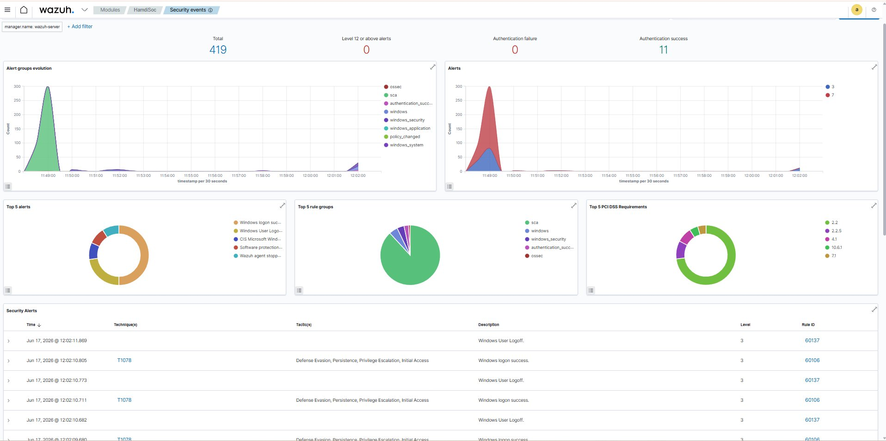
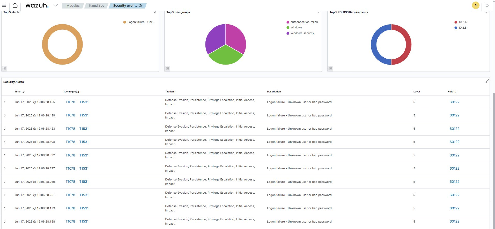
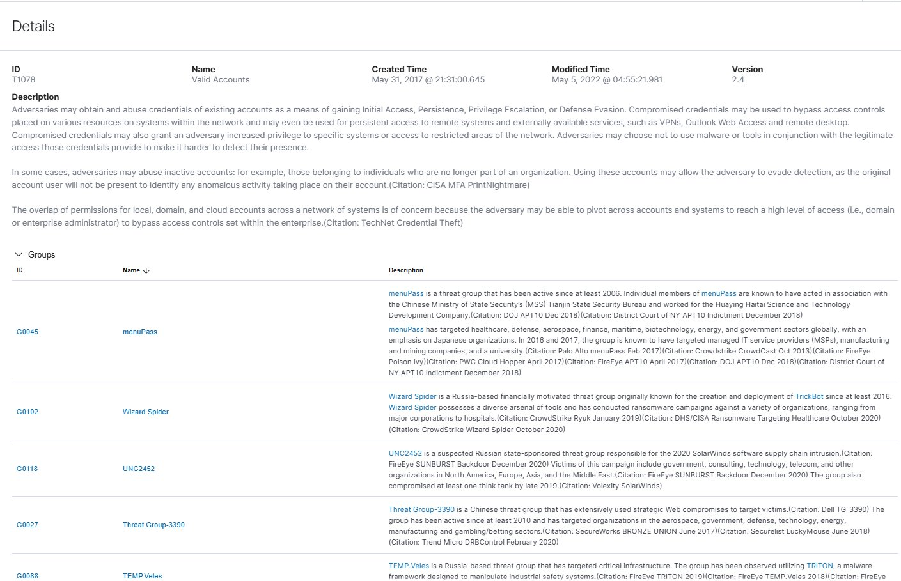

# 🛡️ SOC Analyst Homelab — SSH Brute Force Detection with Wazuh SIEM

> **Built by:** Hamdi  
> **Date:** June 2026  
> **Goal:** Simulate real-world attacks and detect them using a home SIEM — just like a Tier 1 SOC Analyst

---

## 📌 Project Overview

This project documents the setup of a fully functional **Security Operations Center (SOC) homelab** built from scratch using free and open-source tools. The lab simulates a real enterprise environment where a SIEM monitors endpoints and detects attacks in real time.

**This is not a tutorial I followed — I built and troubleshot every part of this myself.**

---

## 🖥️ Lab Architecture

```
┌─────────────────────────────────────────────────┐
│                HOME NETWORK (192.168.1.0/24)     │
│                                                  │
│  ┌─────────────────┐     ┌─────────────────┐    │
│  │  Kali Linux VM  │────▶│ Windows Laptop  │    │
│  │  192.168.1.24   │     │  192.168.1.22   │    │
│  │  (Attacker)     │     │  (Victim/Agent) │    │
│  └─────────────────┘     └────────┬────────┘    │
│                                   │ logs         │
│                          ┌────────▼────────┐    │
│                          │  Ubuntu 26.04   │    │
│                          │  192.168.1.23   │    │
│                          │  Wazuh SIEM     │    │
│                          │  (Monitor)      │    │
│                          └─────────────────┘    │
└─────────────────────────────────────────────────┘
```

---

## 🧰 Tools & Technologies

| Category | Tool | Purpose |
|----------|------|---------|
| SIEM | Wazuh 4.7.5 | Log collection, alerting, dashboards |
| OS — Server | Ubuntu 26.04 LTS | Wazuh server host |
| OS — Attacker | Kali Linux 2024 | Attack simulation |
| OS — Victim | Windows 11 | Monitored endpoint |
| Virtualization | VMware Workstation | Running all VMs |
| Attack Tool | Hydra v9.7 | SSH brute force |
| Wordlist | rockyou.txt | Password dictionary (14M passwords) |
| Framework | MITRE ATT&CK | Threat intelligence mapping |

---

## 📁 Project Structure

```
soc-homelab/
├── README.md                          ← You are here
├── incidents/
│   └── INC-2026-001_SSH_BruteForce/
│       ├── incident_report.docx       ← Full incident report
│       └── screenshots/
│           ├── dashboard_overview.png
│           ├── brute_force_alerts.png
│           └── mitre_attack_t1078.png
└── configs/
    └── wazuh_setup_notes.md           ← Setup notes
```

---

## 🔴 Attack Simulation — SSH Brute Force

### What I Did

Launched a dictionary-based brute force attack from Kali Linux against the Windows endpoint using **Hydra** and the **rockyou.txt** wordlist — the same tools and wordlist used in real-world attacks.

**Attack command:**
```bash
hydra -l hamdi -P /usr/share/wordlists/rockyou.txt ssh://192.168.1.22 -t 4 -V
```

### What Happened

Hydra attempted thousands of SSH login combinations per minute. Every single failed attempt was captured by the Wazuh agent on the Windows machine and forwarded to the Wazuh SIEM in real time.

---

## 📊 SIEM Detection Results

### Dashboard Overview — 419 Total Security Events



The Wazuh dashboard shows the complete security event timeline. Notice the **spike in alerts at 11:49** when the Wazuh agent first connected and started sending Windows security logs, and the **flood of authentication failures at 12:06** when the brute force attack began.

---

### Brute Force Alerts — Real Time Detection



Wazuh detected every single password attempt in real time:

- **Rule 60122** — "Logon failure - Unknown user or bad password"
- **Alert Level 5** — Medium severity
- **Multiple alerts per second** — consistent with automated tooling
- **100% of Top 5 alerts** were authentication failures during the attack
- **PCI DSS 10.2.4 and 10.2.5** compliance violations automatically flagged

---

### MITRE ATT&CK Mapping — T1078 Valid Accounts



Wazuh automatically mapped the brute force attack to **two MITRE ATT&CK techniques**:

| Technique | Name | Tactics |
|-----------|------|---------|
| T1078 | Valid Accounts | Defense Evasion, Persistence, Privilege Escalation, Initial Access |
| T1531 | Account Access Removal | Impact |

**Real threat groups that use T1078:**
- **menuPass (APT10)** — Chinese state-sponsored hackers
- **Wizard Spider** — Russian ransomware group (TrickBot)
- **UNC2452** — Russian group behind SolarWinds attack
- **Threat Group-3390** — Chinese APT targeting aerospace & government

This means the technique I simulated is used by **nation-state level threat actors** in real attacks.

---

## 📋 Incident Report

**Incident ID:** INC-2026-001  
**Severity:** Medium (Level 5)  
**Status:** Detected & Contained

| Field | Value |
|-------|-------|
| Date | June 17, 2026 |
| Attack Type | SSH Brute Force / Credential Attack |
| Source IP | 192.168.1.24 (Kali Linux) |
| Target IP | 192.168.1.22 (Windows Endpoint) |
| Tool Used | Hydra v9.7 + rockyou.txt |
| Detection Time | < 1 second after first attempt |
| Total Alerts | 400+ in under 30 seconds |

Full incident report: [`incidents/INC-2026-001_SSH_BruteForce/incident_report.docx`](incidents/INC-2026-001_SSH_BruteForce/incident_report.docx)

---

## 🔧 Key Skills Demonstrated

- ✅ **SIEM Deployment** — Installed and configured Wazuh SIEM from scratch on Ubuntu
- ✅ **Agent Deployment** — Connected Windows endpoint to SIEM via Wazuh agent
- ✅ **Network Configuration** — Configured VMware bridged networking, firewall rules, SSH
- ✅ **Attack Simulation** — Executed SSH brute force using Hydra
- ✅ **Alert Triage** — Analyzed and categorized security alerts in Wazuh dashboard
- ✅ **Threat Intelligence** — Mapped alerts to MITRE ATT&CK framework
- ✅ **Incident Documentation** — Wrote professional incident report (INC-2026-001)
- ✅ **Troubleshooting** — Diagnosed and resolved NAT, firewall, and network connectivity issues

---

## 🚧 What's Coming Next

- [ ] Add Kali Linux as a monitored agent in Wazuh
- [ ] Run Nmap scan and detect it in SIEM
- [ ] Set up Wazuh active response to auto-block attacking IPs
- [ ] Add vulnerable VM (Metasploitable) as a target
- [ ] Run Metasploit exploits and detect them
- [ ] Write custom Wazuh detection rules
- [ ] Document each attack as a separate incident report

---

## 🧠 What I Learned

1. **Wazuh detects attacks in milliseconds** — real-time alerting works exactly as in enterprise environments
2. **MITRE ATT&CK mapping is automatic** — Wazuh maps alerts to real threat techniques out of the box
3. **Network troubleshooting is a core SOC skill** — solving NAT, firewall, and routing issues is everyday work
4. **Documentation matters** — a detected attack without documentation is useless in a real SOC
5. **rockyou.txt is genuinely dangerous** — password-based authentication should never be used without rate limiting and lockout policies

---

## 📬 Connect With Me

- **LinkedIn:** : https://www.linkedin.com/in/hamdichedl/


---

*This homelab is part of my journey to become a SOC Analyst. Every project here is hands-on, self-built, and documented as I would in a real security operations environment.*
